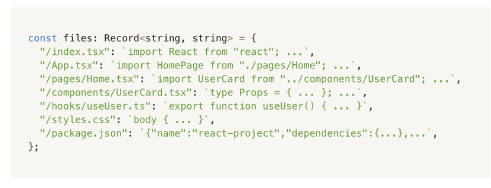

# FigameMcpAgnet

这是一个Nextjs16和Langchain构建的Figame生成UI智能体

## 当前仓库结构

仓库已经调整为 `pnpm monorepo` 结构：

- `apps/web`：当前 Next.js Web 应用
- `packages/*`：后续逐步实现的 agent 核心能力包
- `skills/`：基于目录约定的 skill 定义
- `mcps/`：基于目录约定的 MCP 定义
- `flows/`：基于目录约定的 flow 定义
- `templates/`：Sandpack / 项目模板
- `configs/`：显式配置入口
- `docs/`：架构、计划、指南
- `tests/`：单测、集成测试、E2E

技术栈：

- LangChain + LangGraph
- LLM模型: minimax-m2.7
- Schema: Annotation
- 代码预览技术：Sandpack https://sandpack.codesandbox.io


## Sandpack 原理


## 1. 多模型配置


- 作用：能非常方便的进行模型切换
- 实现方案：
  - 环境变量配置方案，配置兜底模型
  - 配置文件方案：读取配置文件做UI界面切换模式，可自定义
  - 实现细节：可能要预定支持Provide

- 核心API：
  - getXXModle: 获取模型 例如（getDeepSeekModel 、getGLMModel、getQwenVisionModel）
  - getMainModel: 根据主变量获取模型，本质是 switch 分支批评 provider 返回 `getXXModel`
  - getStructuredModel: 结构化输出


伪代码：


```tsx

let deepseekInstance:ChatOpenAI | null = null

/**
 * 获取DeepSeek 主模型实例（用于大部分节点）
 * 支持 Function Calling 结构化输出能力强
**/

export function getDeepSeekModel(){
  if(!deepseekInstance){
    deepseekInstance = new ChatOpenAI({
      model:"deepseek-chat",
      apiKey:"apikey",
      temperature:0,
      maxTokens:8192, // DeepSeek 最大支持8K tokens
      configuration:{
        baseURL: "https://api.deepseek.com"
      }
    })
  }

  return deepseekInstance
}


/* 结构化输出 支持 Function Calling */

export function getStructuredModel<T extends ZodType<any>>(schema:T){
  const model = getMainModel()

  return model.withStructuredOutput(schema,{
    method:"functionCalling",
    includeRaw:false
  })
}

```


## 2. 模板项目

- AI 只生成业务代码，不负责工程脚手架
- 让AI根据工程脚手架输出实际填充
- 模板项目路径： `templates`
- 相关模板：<https://sandpack.codesandbox.io/docs/getting-started/usage#templates>
- 输出的模板：

```tsx

return (
  <SandpackProvider
    key={sandpackKey}
    template="react-ts"
    theme="light"
    files={files}
    options={{
      externalResources:["https://cdn.tailwindcss.com"],
      visibleFiles:visibleFiles,
      activeFile:"/App.tsx"
    }}
    style={{height:"100%",width:"100%"}}
  >

    <div class="relative h-full w-full border-none sandpack-wrapper" >
      {/* loading overlay - 覆盖在 sandpack 之上 让sandpack在后台加载 */}
      {isAssmbling && <BuildingLoadingOverlay />}

      <SandpackLayout><SandpackLayout/>

    <div/>
    
  <SandpackProvider/>
)

```

- 将模板项目的内容组装成files格式，通过  fast-glob 读取所有文件



## 项目组织架构（规划版本）


```bash
figame-make-agent/
├─ apps/
│  └─ web/                                   # Next.js 前端应用
│     ├─ app/
│     │  ├─ api/
│     │  │  ├─ chat/route.ts                 # 对话入口
│     │  │  ├─ agent/route.ts                # agent 执行入口
│     │  │  ├─ preview/route.ts              # 预览/模板相关接口
│     │  │  └─ health/route.ts
│     │  ├─ globals.css
│     │  ├─ layout.tsx
│     │  └─ page.tsx
│     ├─ components/                         # 通用 UI 组件
│     │  ├─ ui/
│     │  ├─ layout/
│     │  └─ feedback/
│     ├─ features/                           # 页面级业务模块
│     │  ├─ agent-chat/
│     │  │  ├─ components/
│     │  │  ├─ hooks/
│     │  │  ├─ services/
│     │  │  └─ types.ts
│     │  ├─ project-preview/
│     │  │  ├─ components/
│     │  │  ├─ sandpack/
│     │  │  └─ services/
│     │  ├─ model-selector/
│     │  ├─ skill-panel/
│     │  ├─ mcp-panel/
│     │  └─ flow-runner/
│     ├─ lib/
│     │  ├─ api-client/
│     │  ├─ server/
│     │  ├─ constants/
│     │  └─ utils/
│     ├─ public/
│     ├─ next.config.ts
│     ├─ package.json
│     └─ tsconfig.json
│
├─ packages/
│  ├─ agent-core/                            # 运行时核心：怎么跑
│  │  ├─ src/
│  │  │  ├─ runtime/                         # agent 生命周期、启动入口
│  │  │  ├─ executor/                        # 执行器
│  │  │  ├─ planner/                         # 规划器
│  │  │  ├─ memory/                          # 记忆/上下文
│  │  │  ├─ events/                          # 流式事件/日志/trace
│  │  │  ├─ session/                         # 会话管理
│  │  │  ├─ context/                         # 执行上下文
│  │  │  ├─ registry/                        # flow/skill/mcp 注册聚合
│  │  │  ├─ errors/
│  │  │  └─ index.ts
│  │  ├─ package.json
│  │  └─ tsconfig.json
│  │
│  ├─ agent-flows/                           # 跑什么流程
│  │  ├─ src/
│  │  │  ├─ registry/                        # flow 注册中心
│  │  │  ├─ shared/                          # flow 共享节点/工具
│  │  │  ├─ ui-generate/
│  │  │  │  ├─ flow.ts
│  │  │  │  ├─ index.ts
│  │  │  │  ├─ nodes/
│  │  │  │  ├─ local-schema.ts
│  │  │  │  └─ prompt.ts
│  │  │  ├─ code-optimize/
│  │  │  │  ├─ flow.ts
│  │  │  │  ├─ nodes/
│  │  │  │  ├─ local-schema.ts
│  │  │  │  └─ prompt.ts
│  │  │  ├─ template-build/
│  │  │  │  ├─ flow.ts
│  │  │  │  ├─ nodes/
│  │  │  │  ├─ local-schema.ts
│  │  │  │  └─ prompt.ts
│  │  │  ├─ project-analyze/
│  │  │  ├─ multi-agent/
│  │  │  └─ index.ts
│  │  ├─ package.json
│  │  └─ tsconfig.json
│  │
│  ├─ agent-schema/                          # 全局共享 schema / annotation / contract
│  │  ├─ src/
│  │  │  ├─ annotation/
│  │  │  ├─ input/
│  │  │  ├─ output/
│  │  │  ├─ domain/                          # 页面/组件/文件/模板领域模型
│  │  │  ├─ graph/                           # flow state / node state
│  │  │  ├─ model/
│  │  │  ├─ mcp/
│  │  │  ├─ skill/
│  │  │  ├─ template/
│  │  │  └─ index.ts
│  │  ├─ package.json
│  │  └─ tsconfig.json
│  │
│  ├─ agent-prompts/                         # Prompt 资产与组装器
│  │  ├─ src/
│  │  │  ├─ system/
│  │  │  ├─ flows/
│  │  │  │  ├─ ui-generate/
│  │  │  │  ├─ code-optimize/
│  │  │  │  ├─ template-build/
│  │  │  │  └─ project-analyze/
│  │  │  ├─ skills/
│  │  │  ├─ mcps/
│  │  │  ├─ fragments/                       # 可复用 prompt 片段
│  │  │  ├─ builders/                        # prompt 拼装器
│  │  │  ├─ guards/                          # 输出约束
│  │  │  └─ index.ts
│  │  ├─ package.json
│  │  └─ tsconfig.json
│  │
│  ├─ model-provider/                        # 模型提供层
│  │  ├─ src/
│  │  │  ├─ providers/
│  │  │  │  ├─ deepseek/
│  │  │  │  ├─ minimax/
│  │  │  │  ├─ openai/
│  │  │  │  ├─ qwen/
│  │  │  │  └─ index.ts
│  │  │  ├─ factory/                         # getMainModel/getStructuredModel
│  │  │  ├─ config/
│  │  │  ├─ cache/
│  │  │  ├─ telemetry/
│  │  │  ├─ types/
│  │  │  └─ index.ts
│  │  ├─ package.json
│  │  └─ tsconfig.json
│  │
│  ├─ mcp-system/                            # MCP 注册、发现、调用
│  │  ├─ src/
│  │  │  ├─ registry/
│  │  │  ├─ discovery/                       # 目录自动发现
│  │  │  ├─ loaders/                         # 配置驱动加载
│  │  │  ├─ adapters/                        # 各类 MCP 客户端适配
│  │  │  ├─ invoker/
│  │  │  ├─ transport/
│  │  │  ├─ validators/
│  │  │  ├─ errors/
│  │  │  └─ index.ts
│  │  ├─ package.json
│  │  └─ tsconfig.json
│  │
│  ├─ skill-system/                          # Skill 注册、发现、执行
│  │  ├─ src/
│  │  │  ├─ registry/
│  │  │  ├─ discovery/                       # 目录自动发现
│  │  │  ├─ loaders/                         # 配置驱动加载
│  │  │  ├─ executor/
│  │  │  ├─ builtins/
│  │  │  ├─ validators/
│  │  │  ├─ context/
│  │  │  ├─ errors/
│  │  │  └─ index.ts
│  │  ├─ package.json
│  │  └─ tsconfig.json
│  │
│  ├─ template-system/                       # 模板工程与文件组装
│  │  ├─ src/
│  │  │  ├─ registry/
│  │  │  ├─ scanner/                         # fast-glob 扫描模板
│  │  │  ├─ assembler/                       # 转成 Sandpack files
│  │  │  ├─ manifest/
│  │  │  ├─ transforms/
│  │  │  ├─ validators/
│  │  │  └─ index.ts
│  │  ├─ package.json
│  │  └─ tsconfig.json
│  │
│  ├─ sandpack-runtime/                      # Sandpack 运行时封装
│  │  ├─ src/
│  │  │  ├─ files/
│  │  │  ├─ preview/
│  │  │  ├─ state/
│  │  │  ├─ transforms/
│  │  │  ├─ templates/
│  │  │  └─ index.ts
│  │  ├─ package.json
│  │  └─ tsconfig.json
│  │
│  ├─ shared/                                # 全局共享工具
│  │  ├─ src/
│  │  │  ├─ constants/
│  │  │  ├─ utils/
│  │  │  ├─ logger/
│  │  │  ├─ types/
│  │  │  ├─ env/
│  │  │  └─ index.ts
│  │  ├─ package.json
│  │  └─ tsconfig.json
│  │
│  └─ config/                                # 配置定义与加载器
│     ├─ src/
│     │  ├─ defaults/
│     │  ├─ loaders/
│     │  ├─ resolvers/
│     │  ├─ validators/
│     │  └─ index.ts
│     ├─ package.json
│     └─ tsconfig.json
│
├─ skills/                                   # 文件约定驱动 skill
│  ├─ builtin/
│  │  ├─ ui-generate/
│  │  │  ├─ manifest.json
│  │  │  ├─ prompt.md
│  │  │  └─ schema.ts
│  │  ├─ code-review/
│  │  └─ template-select/
│  └─ custom/
│     └─ README.md
│
├─ mcps/                                     # 文件约定驱动 mcp
│  ├─ builtin/
│  │  ├─ filesystem/
│  │  │  ├─ manifest.json
│  │  │  ├─ tools.json
│  │  │  └─ schema.ts
│  │  ├─ browser/
│  │  └─ search/
│  └─ custom/
│     └─ README.md
│
├─ flows/                                    # 文件约定驱动 flow 声明
│  ├─ builtin/
│  │  ├─ ui-generate.flow.ts
│  │  ├─ code-optimize.flow.ts
│  │  └─ template-build.flow.ts
│  ├─ custom/
│  └─ manifests/
│
├─ templates/                                # Sandpack / 项目模板
│  ├─ react-ts/
│  │  ├─ src/
│  │  ├─ package.json
│  │  └─ template.manifest.json
│  ├─ figame-base/
│  │  ├─ src/
│  │  ├─ public/
│  │  ├─ package.json
│  │  └─ template.manifest.json
│  ├─ figame-dashboard/
│  └─ shared/
│
├─ configs/                                  # 显式配置驱动
│  ├─ agent.config.ts
│  ├─ flow.config.ts
│  ├─ model.config.ts
│  ├─ mcp.config.ts
│  ├─ skill.config.ts
│  ├─ template.config.ts
│  └─ app.config.ts
│
├─ docs/
│  ├─ architecture/
│  │  ├─ overview.md
│  │  ├─ runtime.md
│  │  ├─ flows.md
│  │  ├─ skills.md
│  │  ├─ mcps.md
│  │  ├─ prompts.md
│  │  └─ schemas.md
│  ├─ guides/
│  │  ├─ add-new-flow.md
│  │  ├─ add-new-skill.md
│  │  ├─ add-new-mcp.md
│  │  └─ add-new-template.md
│  ├─ plans/
│  └─ adr/
│
├─ tests/
│  ├─ unit/
│  │  ├─ agent-core/
│  │  ├─ agent-flows/
│  │  ├─ mcp-system/
│  │  ├─ skill-system/
│  │  └─ template-system/
│  ├─ integration/
│  │  ├─ flow-execution/
│  │  ├─ mcp-integration/
│  │  ├─ skill-integration/
│  │  └─ sandpack-preview/
│  └─ e2e/
│     └─ web/
│
├─ .changeset/
├─ .env.example
├─ .gitignore
├─ eslint.config.mjs
├─ package.json
├─ pnpm-workspace.yaml
├─ tsconfig.base.json
├─ turbo.json
└─ README.md

```
