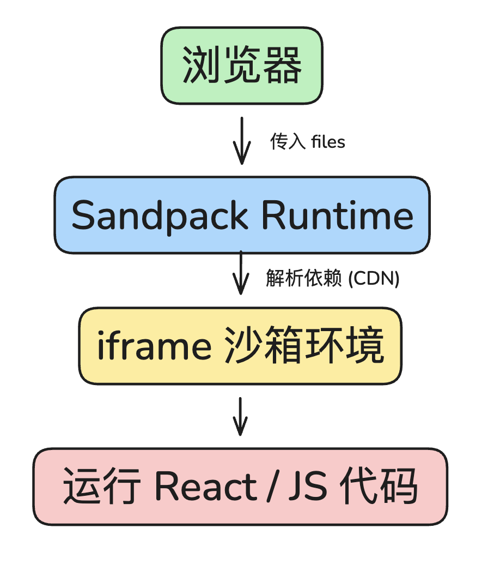
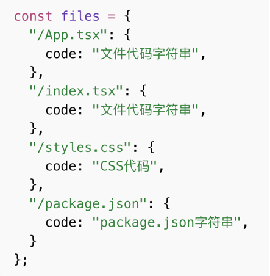

## Sandpack 原理





## 2. 模板项目

- AI 只生成业务代码，不负责工程脚手架
- 让AI根据工程脚手架输出实际填充
- 模板项目路径： `templates`
- 相关模板：[https://sandpack.codesandbox.io/docs/getting-started/usage#templates](https://sandpack.codesandbox.io/docs/getting-started/usage#templates)
- 输出的模板：

```tsx

return (
  <SandpackProvider
    key={sandpackKey}
    template="react-ts"
    theme="light"
    files={files}
    options={{
      externalResources:["https://cdn.tailwindcss.com"],
      visibleFiles:visibleFiles,
      activeFile:"/App.tsx"
    }}
    style={{height:"100%",width:"100%"}}
  >

    <div class="relative h-full w-full border-none sandpack-wrapper" >
      {/* loading overlay - 覆盖在 sandpack 之上 让sandpack在后台加载 */}
      {isAssmbling && <BuildingLoadingOverlay />}

      <SandpackLayout><SandpackLayout/>

    <div/>
  
  <SandpackProvider/>
)

```

- 将模板项目的内容组装成files格式，通过  fast-glob 读取所有文件
  
